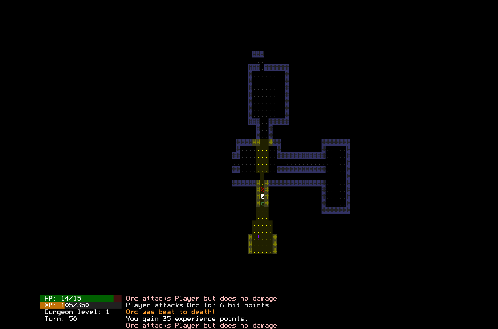

# NoobRL

A traditional turn-based roguelike dungeon crawler written in Python using the
[tcod](https://python-tcod.readthedocs.io/) library. Features procedurally
generated dungeons, component-based entities, JSON-driven monster and item
definitions, equipment, consumables, a leveling system, and full save/load
support.

## Work Items

Ideas & efforts under way.

### FIXES / WIP
- [ ] some monsters should patrol rooms, even before spotting you
- [ ] allow monsters to be asleep, fall asleep
  - [ ] have Potion of sleep
  - [ ] allow potions to be thrown (at monsters), and convey their powers when they break

### General
- [ ] ability to "go to" dungeon feature (e.g., '>')
- [ ] JSON-ify all the tables (monsters, items, spells, loot drops)
- [ ] use different, appropriate sfx for wizard attack
- [ ] for variety, each text trigger maps to a SET of sfx, not just one
- [ ] balance game, avoid becoming god too early; levels ups should occur exponentially further

### Interesting Mechanics
- [ ] simulate noise and monster hearing
- [ ] hunger and food items
- [ ] item weights and maximum carry weight
- [ ] incremental knowledge: ability to see monster weaknesses, attack power, def, etc... depends on # vanquished
- [ ] anonymized consumables: i.e., nature of consumables not immediately known (like Nethack)
  - [ ] offer Scrolls of Identify to be found/bought, "identifying services"

### Map Generation
- [ ] scrollable map (i.e., map larger than rendered window)
- [ ] improved map generation - make them more interesting, perhaps sometimes variations of rooms
- [ ] consider POI/room set pieces, that are just "pasted" in the worldgen
- [ ] procgen chests with loot
- [ ] rooms should have doors (but not always); also, sometimes they would be locked
- [ ] secret doors!
- [ ] hidden traps: squeaky board, pit, fall-through to lower level, teleport trap

### Weapons & Armour
- [ ] variable damage on weapons (e.g., 1d10)
- [ ] different types of damage: various melee (blunt, pierce, slash), fire, ice, etc.
  - [ ] add monster weaknesses (e.g., damage type)
- [ ] armour and weapon properties that affect crit_chance and crit_mult
- [ ] more types of weapons
- [ ] more types of armour (maybe separate: chest, helmet, gloves, etc)
- [ ] weapon and armor enchantments
- [ ] vampiric weapons, weapon egos in general / rarities
- [ ] armor set powers? P3

### Items (Potions, Scrolls, Powers, etc)
- [ ] add potion: Berserk - 50% more damage for 10 turns
- [ ] add scroll: Teleport (user-controlled target, must be in explored space)
- [ ] add rings
- [ ] add more wands
  - [ ] wands should have charges, be non-stackable
- [ ] items react to nearby spells (e.g., fireball makes a potion explode)
- [ ] maybe: magic proficiency skill, which multiplies damage to all magical effects
- [ ] rethink colours and glyphs used for consumables
- [ ] digging tools, wands - modify the dungeon walls, but slow
- [ ] wand of wishing should even be able to spawn monsters
- [ ] maybe later add max stack size for consumables

### Enemies
- [ ] Banshee:(Do not attack, but if seen, will scream and alert within a given radius)
- [ ] Enemy special powers (Ex: speed, strength, invisibility, etc...)
- [ ] Enemies should sometimes drop loot when killed
- [ ] Find something useful to do with monster corpses (food? crafting?)

### UI

### Miscellaneous
- [ ] consider additional magic system: mana pool and spells/spellbooks
- [ ] shop keepers

### DONE
- [x] potion of speed - double move speed for N turns
- [x] want wider text on the bottom
- [x] monsters should have memory of where they last saw you, and proceed there even if you disappeared
- [x] potion of invisibility (useful for debugging monster memory)
- [x] don't use color.health_recovered, unless specifically describing health
- [x] why are orcs unable to damage you from the start? armor too strong?
- [x] v command should show more info about the monsters, just like the details screen in inventory
- [x] finish fixing the comb-like corridors; perhaps diff algo altogether?
- [x] add amulets
- [x] have an amulet of clairvoyance, which triggers effect on each level (not naturally spawnable; for debugging)
- [x] avoid corridors two squares wide
- [x] when you die, should be able to press Enter, and then be taken to Main Menu (also show stats)
- [x] command which lists items, monsters, corpses, and features visible from current location (Shift+V), with relative directions and distance sorting
- [x] there should be a distinction between a "known about" square vs "already visited"
  - [x] claivoyance should only update unknown -> known
- [x] add counters for how many of each monster you killed on current run
- [x] print stats on run finish (death), or using special command (part of 'c'?)
- [x] what's up with the debug console? does it work?
- [x] wand of wishing - primarily for debugging purposes, allows spawning any item in the game
- [x] clairvoyance reveals only room outlines and corridors, not deep rock
- [x] add potion: Clairvoyance
- [x] Wizards
- [x] fully heal on level up!
- [x] expand Look function (around level) to provide more info (incl. HP left on monster, maybe attack power, def)
- [x] add scroll: Blink (and/or general Teleport)
- [x] N/A name:(Fast enemy(2 studs), but is weak and not very strong.)
- [x] add sfx for crit hits
- [x] Higher crit chance for dragon enemy or overall powerful mobs
- [x] help button that tells all the keybinds
- [x] stack items (e.g., all potions of healing should take one inventory slot)
- [x] fix Shift-motion, such that player DOES enter open room
- [x] have upwards stairwells, but then regen levels (like in Angband)
- [x] have function to examine item in inventory; flavour text, stats, etc

## Design Choices

Open question:
- item cardinality per floor square
  - should dungeon floor be restricted to one item per square? (a la Nethack)
  - items than would have to "spill" over many squares (e.g., monster dies and drops multiple items)
  - or do we allow multiple items, a la CDDA?
    - if so, need some way to indicate (in ASCII mode) squares that contain >1 item
  - currently proceeding with latter choice (multi-item) but have not figured out representation
- Should health auto-regenerate over time?
  - maybe this is a choosable character trait
